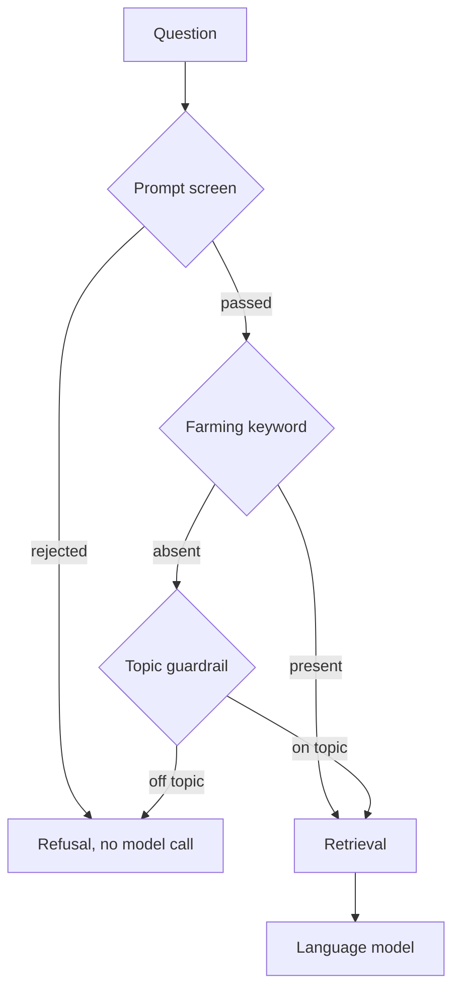

The **Assistant** answers questions about your farm: whether Thursday is sprayable, what the nutrient plan says for a field, what an NVZ record needs. It reads the farm's records and the knowledge base, and it refuses questions that aren't about farming.

## The Science

**Retrieval-augmented generation** gives a language model documents it never trained on. The question is embedded, turned into a vector of numbers that stands for its meaning. The nearest chunks of the knowledge base are found by cosine similarity, a measure of how alike two vectors are. Those chunks go into the prompt as context. The model answers from that context rather than from memory. That is what makes citations possible and reduces fabrication (Lewis et al., 2020).

A smaller classifier in front of the main model is a standard guardrail. It is cheap to run, and it keeps the main model for on-topic work.

## How It's Applied

Every turn passes the screens before the main model is called.

| Step | What happens |
|---|---|
| **Rate limit** | Ten messages a minute and two hundred a day per user. Clearing the chat does not reset the count. |
| **Prompt screen** | A fixed set of checks strips control characters, caps the length at 4,000 characters and rejects known injection patterns. A rejected message gets the refusal copy and never reaches a model. |
| **Fast path** | A keyword list of farming terms lets an obviously on-topic question skip the guardrail call. |
| **Topic guardrail** | A smaller language model classifies the question as on or off topic. An empty or malformed reply is not read as approval. |
| **Retrieval** | The question is embedded and the nearest knowledge base chunks are fenced into the prompt as untrusted context. |
| **Main turn** | The language model answers from the last ten messages of history and the retrieved chunks. |
| **Storage** | Each message stores the chunks it used and the guardrail result. |

## Limits

* The assistant answers about this farm and about farming. Anything else is refused before a model is called.
* Knowledge base text is treated as untrusted. It is screened when saved and fenced when retrieved.
* Every answer is reportable from the app. Reports carry a snapshot of the content.

## References

1. Lewis, P. et al. (2020). [Retrieval-Augmented Generation for Knowledge-Intensive NLP Tasks](https://arxiv.org/abs/2005.11401). *Advances in Neural Information Processing Systems* 33.

