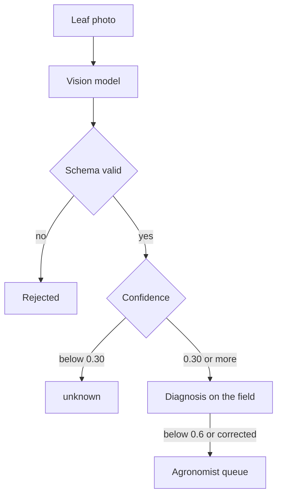

**Scout Photo Diagnosis** takes a photograph of a leaf and returns the most likely disease or pest, a confidence score and what the model saw. The name of the species and the suggested treatment come from a curated list, not from the model.

## The Science

A **vision language model** is a general model that accepts an image and text and answers in text. Asked for a structured answer, it can name a disease from what it sees on the leaf. But its confidence is not calibrated, so the score is not a true probability. Its free text can also drift. Two controls keep it useful. The answer is constrained to a fixed set of classes and checked against a schema. The output goes to a person before it becomes advice. Grower corrections and expert labels then build the dataset a specialist detector is trained on.

## How It's Applied

The vision model's answer passes two thresholds before it is shown.

| Control | Value |
|---|---|
| Model | A vision model |
| Answer format | A fixed structure with a species, a confidence and observations. A reply that doesn't fit it is rejected whole, never scraped. |
| Confidence floor | 0.30. Below it the diagnosis is stored as `unknown`, with the model's answer kept for training. |
| Species | A curated list of twelve classes. The model supplies only the species. Name and treatment come from the list. |
| Labelling threshold | 0.6. Diagnoses below it, and any the grower corrected, enter the agronomist queue. |

The grower can correct any diagnosis and report it from the app. Corrections take priority in the labelling queue. Confirmed labels are stored with the crop, growth stage and region, so validation can hold out whole seasons and regions.

## Limits

* The model's guess is never treated as truth. It speeds annotation and measures agreement with experts.
* Photos are stripped of location data and downscaled before they reach the model.
* Confidence is the model's own and is treated as indicative.
